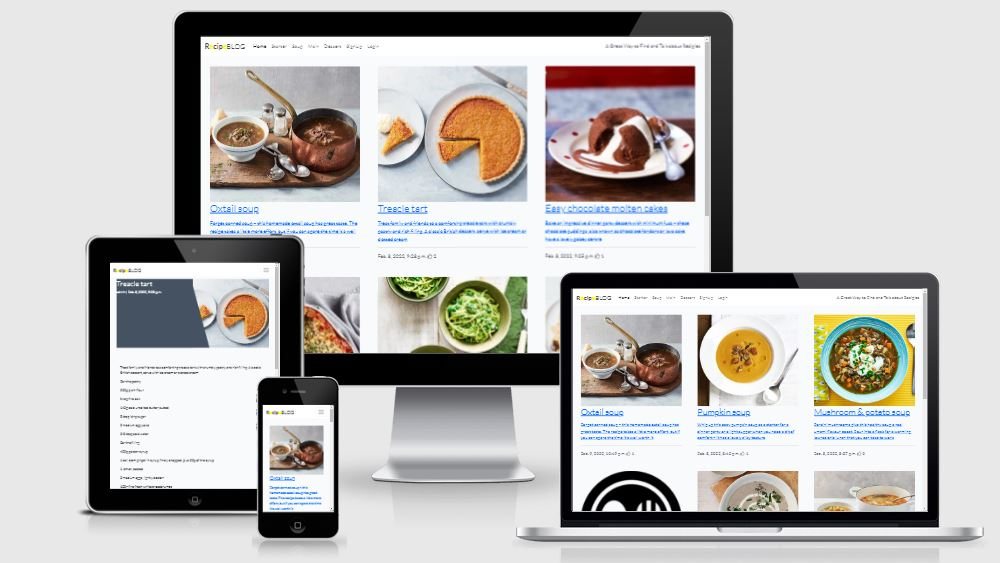
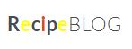

<h1 align="center">RecipeBLOG</h1>



<span id="recipeBlog"></span>

The RecipeBLOG is a recipe website that allows users to like and comment on recipes that are posted by the adminstrator of the site.

I got inspraion from the application in the walk through that we did in this module, I think therefore i Blog.

The recipes are divied by the courses, Soup, Starters, Mains, Dessert.

This site will give the users instructions on how to prepare a meal and allow users to have a discussion on the each recipe

**[View the live project here.](https://myrecipies.herokuapp.com/)**

---

## Index 

- <a href="#ux">1. User experience (UX)</a>
  - <a href="#ux-goals">1.1. Project goals</a>
  - <a href="#ux-stories">1.2 User stories</a>
  - <a href="#ux-design">1.3 Design</a>
  - <a href="#ux-architecture">1.4 Information architecture</a>
  - <a href="#ux-mockup">1.5 Mockup designs</a>
- <a href="#features">2. Features</a>
  - <a href="#features-existing">2.1 Existing features</a>
  - <a href="#features-future">2.2 Features left to implement in the future</a>
- <a href="#technologies">3. Technologies used</a>
- <a href="#testing">4. Testing</a>
- <a href="#deployment">5. Deployment</a>
- <a href="#credits">6. Credits</a>
- <a href="#Acknowledge">7. Acknowledge</a>
- <a href="#Acknowledge">8. Disclaimer</a>

---

<span id="ux"></span>

<h1>1. User experience (UX)</h1>

<span id="ux-goals"></span>

### 1.1 Project goals 

- Making a full-stack site that allows users to manage a common dataset about a particular domain. 
- Making a full-stack site that uses HTML, CSS, JavaScript, Python+Flask and PostGresDB.
- Creating a website that serves as a platform where people can learn new recipes, like and start a conversation regarding each recipege. 
- Creating a website that is simple to understand and easy to navigate.

<span id="ux-stories"></span>

### 1.2 User stories 

**First-time visitor goals:**
1. As a first time visitor, I want to be able to visit the website on every device, so that I can look at the website on desktop, mobile and tablet. 
2. As a first time visitor, I want to be able to navigate easily through the website, so I can find everything easily. 
3. As a first time visitor, I want to see an overview of all recipes, so I can get inspired by all recipes.
4. As a first time visitor, I want to be able to search recipes by categories, so I can quickly scan the recipes by category. 
5. As a first time visitor, I want to register an account on the website, so I can like a recipe and leave a comment. 

**Site member goals:** 

All the goals of first-time visitors also apply for site members. There are additional user stories to the site members because they have more access to the website. See the additional user stories below. 
1. As a site member, I want to login to my profile, so that I can give feedback on a recipe.  
2. As a site member, I want to add a comment to a recipe.
3. As a site member, I want to give credit to a recipe by giving it a thumbs up. 
4. As a site member, I want to logout to my profile, so I can logout from my profile. 


**Admin goals:**

All the goals of the first time visitors and site members also apply for the admin. The admin has additional user stories to manage the categories of the recipes. 
1. As an admin, I want to be able to add a recipe to the website.
2. As an admin, I want to be able to approve a message before it is displayed in the website. 

<span id="ux-design"></span>

### 1.3 Design 

- #### Colour scheme 
I kept this website very neutral so that it doesnt take away from the recipe images.  WHite for the header and footer and a offwhite for the recipes.  I added some colour to the RecipeBLOG to brighten the header. 




- #### Fonts
The **Lato** are used throughout the whole website. Sans serif and cursive are the fallbacks in case the main font isn’t being imported to the site correctly.  

- #### Icons
In the project, for the thumbs up, I used the icons provided by [Font Awesome](https://fontawesome.com/).  

- #### Images
As was used in the walkthrough project, i used Cloudinary for my Images. 

- #### Interactive design 

    - The website is basic and has the courses on the header so that they can select an option and can easliy logout. 

<span id="ux-architecture"></span>

### 1.4 Information architecture
 I have crated a model for the recipe and one for the comments.  I have used allauth for my login and logout. 

### 1.5 Mockup designs
Mockup designs are made with [Balsamic.](https://balsamiq.com/)

Click on the links below to view.
|    Mobile   |    Tablet / Desktop   | 
|    :----:    |     :----:   |   
|[RecipeBLOG](https://github.com/colmhaugh/RecipeBlog/blob/main/readme/balsamic/Recipe%20for%20Android.bmpr)|[RecipeBLOG](https://github.com/colmhaugh/RecipeBlog/blob/main/readme/balsamic/Recipe%20for%20LargerScreens.bmpr) | 

<span id="features"></span>

<h1>2. Features</h1>

<span id="features-existing"></span>

### 2.1 Existing features 

#### 1. Design 
- A basic, uncluttered layout with consistency.
- Simple navigation throughout the website by using the navigation bar. 
- Displaying nice images and easy to follow instructions.

#### 2. General 
- The home page has a list of all the recipes ordered by the newest. 
- Using pagenation of 6, we are displaying only 6 recipes per page. 
- Users can select that type of recipe they want to view. 

#### 3. Recipes
- When a user is logged in they can add a comment to a recipe. 
- The logged in user can like a Recipe.
- Recipes include an image of the recipe, an overview of the recipe,  ingredients and  instructions.

#### 4. Signup, login and logout 
- Like in the walkthrough, I have used allAuth for to handle the login and logout. 
- People can create a new account on the web application. 
- People can login with their existing accounts. 
- People can easily log out.


<span id="features-future"></span>

### 2.2 Features left to implement in the future 
- Logged in users to add their own recipe.
- Logged in user to view just the recipes that they like.

<span id="technologies"></span>

<h1>3. Technologies used</h1>

#### Languages used
- [HTML5](https://en.wikipedia.org/wiki/HTML5)
    - HTML5 provides the structure and the content for my project. 
- [CSS3](https://en.wikipedia.org/wiki/Cascading_Style_Sheets)
    - CSS3 provides the style of the HTML5 elements.
- [jQuery](https://jquery.com/)
    - jQuery used as the JavaScript functionality.
- [Python](https://www.python.org/)
    - Python provides the backend of the project.
- [Django](https://www.djangoproject.com/)
    - Python-based framework that follows the model–template–views architectural pattern.


#### Frameworks, libraries & Other
- [Gitpod](https://www.gitpod.io/) 
    - The GitPod is used to develop the project.
- [Git](https://git-scm.com/)
    - The Git was used for version control to commit to Git and push to GitHub.
- [GitHub](https://github.com/)
    - The GitHub is used to host the project.
- [Google Fonts](https://fonts.google.com/)
    - Google Fonts is used to provide the font roboto for all the text that is used in the project. 
- [Balsamic](https://balsamiq.com/)
    - Balsamic is used to create the mockup designs for the project.
- [PostgreSQL](https://www.postgresql.org/)
    - PostgreSQL is the open Source Relational Database that was used for the project.
- [Heroku](https://dashboard.heroku.com/)
    - Heroki is the cloud platform to deploying the app.
- [AllAuth](https://django-allauth.readthedocs.io/en/latest/)
    - Django-allauth was used for registeration, login and log out.

#### Testing tools used 
- [Chrome DevTools](https://developers.google.com/web/tools/chrome-devtools/open) is used to detect problems and test responsiveness.
- [Autoprefixer](https://autoprefixer.github.io/)
    - Autoprefixer is used to parse the CSS and to add vendor prefixes to CSS rules. 
- [W3C Markup Validation Service](https://validator.w3.org/)
    - The W3C Markup Validation Service is used to check whether there were any errors in the HTML5 code. 
- [W3C CSS validator](https://jigsaw.w3.org/css-validator/)
    - The W3C CSS validator is used to check whether there were any errors in the CSS3 code.
- [JShint](https://jshint.com/)
    - JShint is a JavaScript validator that is used to check whether there were any errors in the JavaScript code. 
- [PEP8](http://pep8online.com/)
    - The PEP8 validator is used to check whether there were any errors in the Python code.

<span id="testing"></span>

<h1>4. Testing</h1>

## 1. Code validators
 - **[HTML Validator](https://validator.w3.org/):** Some errors due to django.
    - With testing the HTML code, I had some syntax issues on all pages I build with django templating.
    - I tested the HTML code by running my server locally and used view page source. This code I passed through the validator.
    - Some doctype errors that can be ingored as seen on slack chat.

- **[CSS Validator](https://jigsaw.w3.org/css-validator/):** No errors found.

- **[Python validator | PEP8](http://pep8online.com/):** No errors found

---

<span id="responsiveness"></span>

## 2. Responsiveness 
- Responsiveness of the project is tested with [Chrome DevTools](https://developers.google.com/web/tools/chrome-devtools).
- The project is tested on the following devices: 
    - Desktop, Mobile & Tablet.  
    - On ChromeDevTools used some of their devices for further testing.

---

## 4. Testing user stories 

1. As a user i want to click on a recipe so that I can see the the details of the recipe. 
    - The user can click on a recipe and a detail page will open with the details required.
2. As a user i want to view a paginated list of recipes so that I can select what recipe i want to view. 
    - The user will see a maximum of 6 recipes per page.  I created multiple recipes for each category and tested that a next and previous buttons worked on each page. 
3. As a user i want to see how many likes a recipe has so that i can see the most popular recipe.
    - A user can see a thumbs up and a number beside it to see how many like the recipe got. 
4. As a user i want to be able to like a post so that i can interact with the recipe.
    - A logged in user can like and unlike a post.  If a user is not logged in they cannot like a post.
5. As an Administrator, i want to add a recipe so that other users can view my recipe and give comments or like on it.
    - I added recipes in the backend and approved them so that they appear on the website. 
6. As a user i want to be able to register an account so that add recipes, likes and comments.
    - I created and deleted test user accounts.  All this was handled by allAuth.
7. As a user i want to be able to filter the recipes so that i can view the list of recipes available for that cource.
    - I added courses to the header so that they appear on all pages so that the user can easily choose which course they want to see the recipes for.  I clicked all cources on multiple devices to ensure that the correct course appeared.
8. As a logged in user i want to be able to add a comment to a recipe so that i can give feed back on a recipe.
    - I created multiple test accounts and added comments to different recipes to ensure that the comments appeared.  I tested that if the user was not logged in that they were not able to add comments.
9. As a user i want to view comments so that i can see what is being said about each recipe.
    - I tested wile logged in and out to check that the user can view the comments on each recipe.
10. As a site admin i want to create, read, update and delete recipes so that manage the content on the site.
    - I tested the recipes did not appear on the site until they were approved.
10. As a site admin i want to approve the comments before they appear on the site.
    - I added comments and checked tested that they didnt appear on the site until approved by the administrator.


<h1>5. Deployment</h1>

#### Requirements 
- Python3 
- Github account 
- Heroku account

#### Clone the project 
To make a local clone, follow the following steps. 
1. Log in to GitHub and go to the repository. 
2. Click on the green button with the text **“Code”.**
3. Click on **“Open with GitHub Desktop”** and follow the prompts in the GitHub Desktop Application or follow the instructions from **[this link](https://docs.github.com/en/free-pro-team@latest/github/creating-cloning-and-archiving-repositories/cloning-a-repository#cloning-a-repository-to-github-desktop)** to see how to clone the repository in other ways. 


#### Heroku Deployment  
1. Set up local workspace for Heroku 
    - In terminal window of your IDE type: **pip3 freeze -- local > requirements.txt.** (The file is needed for Heroku to know which filed to install.)
    - In termial window of your IDE type: **python app.py > Procfile** (The file is needed for Heroku to know which file is needed as entry point.)
2. Set up Heroku: create a Heroku account and create a new app and select your region. 
3. Deployment method 'Github'
    - Click on the **Connect to GitHub** section in the deploy tab in Heroku. 
        - Search your repository to connect with it.
        - When your repository appears click on **connect** to connect your repository with the Heroku. 
    - Go to the settings app in Heroku and go to **Config Vars**. Click on **Reveal Config Vars**.
        - Enter the variables contained in your env.py file. it is about: **CLOUDINARY_URL, DATABASE_URL, SECRET_KEY**
4. Push the requirements.txt and Procfile to repository. 
     ```
    $ git add requirements.txt
    $ git commit -m "Add requirements.txt"

    $ git add Procfile 
    $ git commit -m "Add Procfile"
    ```
5. Automatic deployment: Go to the deploy tab in Heroku and scroll down to **Aotmatic deployments**. Click on **Enable Automatic Deploys**. By **Manual deploy** click on **Deploy Branch**.

Heroku will receive the code from Github and host the app using the required packages. 
Click on **Open app** in the right corner of your Heroku account. The app wil open and the live link is available from the address bar. 


<span id="credits"></span>

<h1>6. Credits</h1>

This project is based on the walkthrough project and also using project example Idea 2.  A ot of the code that I used in the walkthrough project I also used on this project.

#### Recipes
- I got the recipes and images from [BBC Good Food](https://www.bbcgoodfood.com/). 

#### Code
- Code Institute walkthrough project I think therefore I blog.

<span id="Acknowledge"></span>

<h1>7. Acknowledge</h1>

Thanks to the following people and organizations who helped or inspired me for the project:  
- The support and guidance of my mentor Precious Ijege. 
- The lessons and knowledge of [Code Institute.](https://codeinstitute.net/)
- The advice about bugs from Slack community.

Thanks for visiting

<a href="#RecipeBLOG">Back to top!</a>